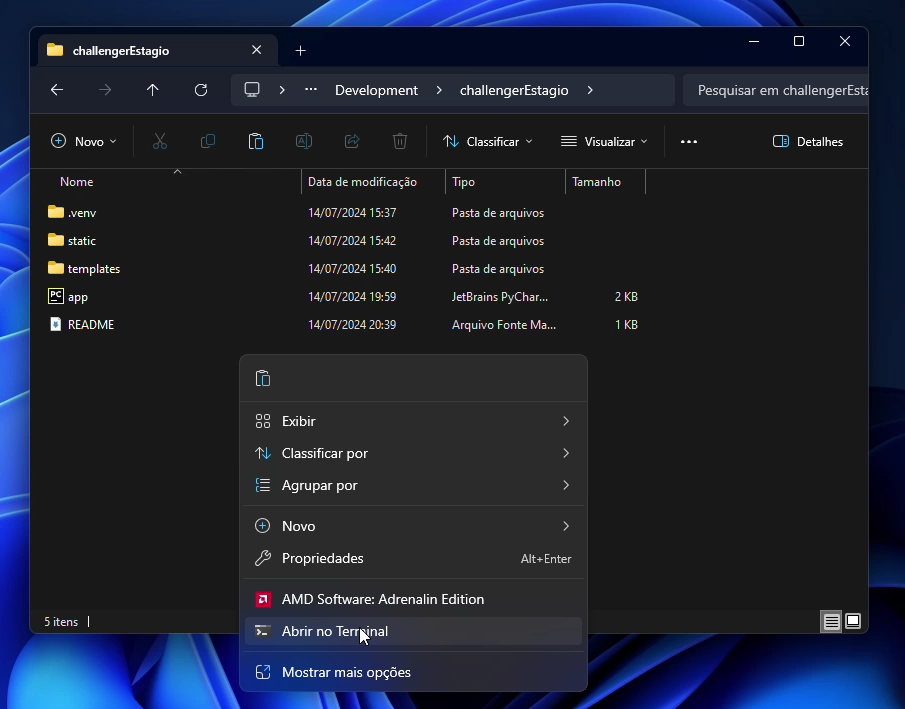
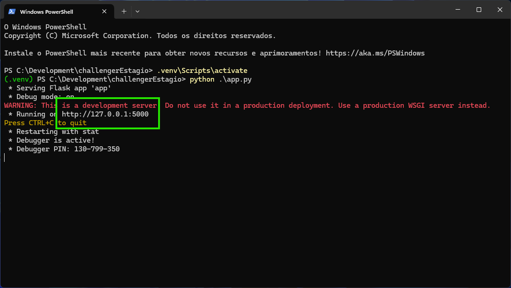

# Desafio Esatgio Web

Este projeto foi desenvolvido utilizando o framework web Flask, em Python, em conjunto com as bibliotecas Bootstrap e DataTables para criar interfaces de usuário modernas e responsivas. O banco de dados MySQL foi gerenciado através do phpMyAdmin, utilizando o servidor XAMPP para facilitar a administração e o desenvolvimento.

##### Banco de Dados

Para executar o projeto, primeiro configure a conexão com o MySQL, se necessário, no arquivo `app.py` localizado na pasta do projeto.

Configuração padrão para a conexão do banco de dados:

```python
host='localhost',
port=3306,
user='root',
passwd='',
database='db_desafio',
```

Utilize o arquivo do banco de dados localizado em `/database/db.sql` para rodar no SGBD.


##### Executar

Após isso abrir a pasta do projeto no terminal



Digite os seguinte comando:

```
.venv\Scripts\activate
python .\app.py
```

Copie o link ou clique + ctrl para executar o projeto


